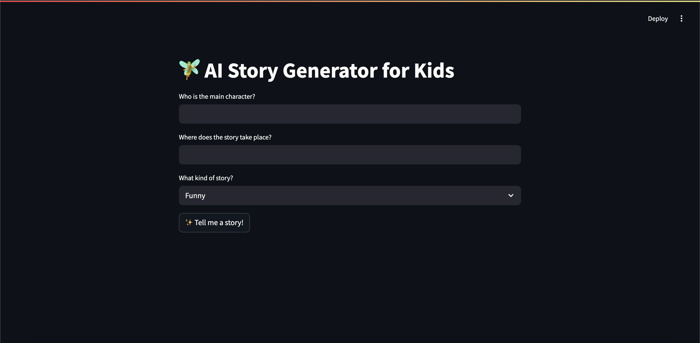
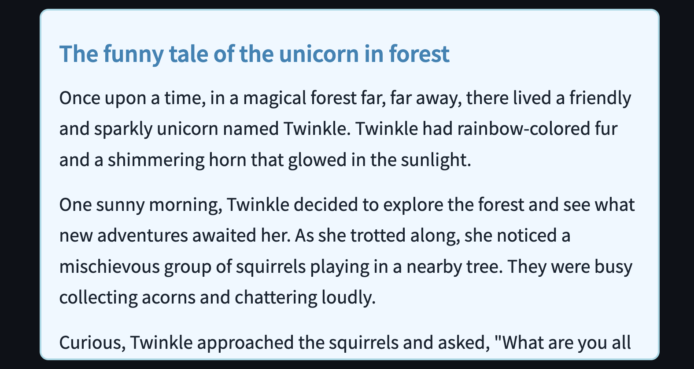

# story_app_for_kids💖
A story telling app for kids. This app uses the well-known GPT-3.5-turbo model and Streamlit for the interface.

## What it does
It generates stories with elements you input, such as the character, the location, and the kind of story(e.g. funny story). 

  

## Example Output

  

## How to run
Clone this repository:
```bash
git clone https://github.com/mamiM/story_app_for_kids.git
cd story_app_for_kids
```


## Set up your environment:

  1. Create a virtual environment 
 ```bash
 python -m venv .venv '
``` 
  2. Activate it (use the one appropriate for your OS) 
  ```bash
  source .venv/bin/activate #For Mac/Linux
```
  ```bash
.venv\Scripts\activate # For Windows
```

## Requirements
Python 3.8+ Streamlit OpenAI and its API key 

You can install everything with:
```bash
pip install openai streamlit
```

## Notes
This was my first story generating project built using Python and Streamlit! It's simple and child-friendly.
